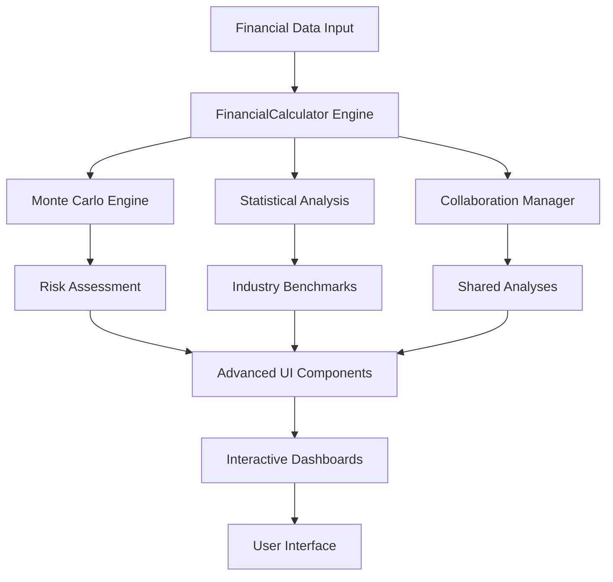

# Phase 2 Advanced Features - Architecture Overview

## Introduction

This document provides a comprehensive overview of the Phase 2 advanced features implemented in the Financial Analysis Toolkit. Phase 2 represents a significant evolution from the core DCF/DDM/P/B analysis capabilities, introducing sophisticated risk modeling, collaboration features, machine learning integration, and advanced user interface components.

## Core Phase 2 Architecture

### 1. Advanced Analytics Engine (`core/analysis/`)

The Phase 2 analytics engine extends the base financial calculations with sophisticated statistical modeling and risk assessment capabilities.

#### Monte Carlo Simulation Engine (`core/analysis/statistics/monte_carlo_engine.py`)
- **Purpose**: Probabilistic financial analysis and risk assessment
- **Key Features**:
  - DCF Monte Carlo simulation with uncertainty modeling
  - Parameter uncertainty handling (revenue growth, margin volatility, discount rates)
  - Risk assessment (VaR, CVaR calculations)
  - Scenario analysis with best/worst/likely outcomes
  - Distribution fitting from historical data
  - Correlation modeling for realistic simulations

**Key Classes**:
- `MonteCarloEngine`: Main simulation orchestrator
- `ParameterDistribution`: Statistical distribution modeling
- `RiskMetrics`: Risk assessment and analysis
- `SimulationResult`: Container for simulation output and statistics

**Usage Example**:
```python
from core.analysis.statistics.monte_carlo_engine import MonteCarloEngine
from core.analysis.engines.financial_calculations import FinancialCalculator

calc = FinancialCalculator('AAPL')
monte_carlo = MonteCarloEngine(calc)

result = monte_carlo.simulate_dcf_valuation(
    num_simulations=10000,
    revenue_growth_volatility=0.15,
    discount_rate_volatility=0.02
)

print(f"Expected Value: ${result.mean_value:.2f}")
print(f"95% Confidence Interval: ${result.ci_95[0]:.2f} - ${result.ci_95[1]:.2f}")
print(f"Value at Risk (5%): ${result.var_5:.2f}")
```

#### Price-to-Book Statistical Analysis (`core/analysis/pb/pb_statistical_analysis.py`)
- **Purpose**: Advanced P/B ratio analysis with historical context
- **Features**:
  - Industry benchmarking and peer comparison
  - Historical P/B trend analysis
  - Fair value calculations based on statistical models
  - Risk-adjusted P/B valuations

### 2. Collaboration Framework (`core/collaboration/`)

Phase 2 introduces comprehensive collaboration capabilities for sharing analyses, annotations, and workspaces.

#### Collaboration Manager (`core/collaboration/collaboration_manager.py`)
- **Purpose**: Central coordination for all collaborative features
- **Key Features**:
  - Analysis sharing with permission management
  - Real-time annotations and comments
  - Shared workspaces for team collaboration
  - Activity tracking and analytics
  - Public discovery and search

**Core Components**:
- **Analysis Sharing**: Share financial analyses with customizable permissions
- **Annotations**: Add contextual comments and insights to specific analysis sections
- **Shared Workspaces**: Collaborative environments for teams
- **Event Tracking**: Comprehensive audit trail of collaborative activities

**Usage Example**:
```python
from core.collaboration.collaboration_manager import CollaborationManager
from core.user_preferences.user_profile import UserProfile

collab_manager = CollaborationManager()
user_profile = UserProfile(user_id="analyst1", username="John Doe")

# Share an analysis
shared_analysis = collab_manager.create_analysis_share(
    analysis_data=analysis_results,
    user_profile=user_profile,
    title="AAPL Q4 2024 DCF Analysis",
    description="Comprehensive DCF analysis with Monte Carlo scenarios",
    is_public=False,
    allow_comments=True
)

# Add annotation
annotation = collab_manager.add_annotation(
    analysis_id=shared_analysis.analysis_id,
    user_profile=user_profile,
    annotation_type=AnnotationType.INSIGHT,
    title="Key Risk Factor",
    content="Revenue growth assumptions may be optimistic given market conditions",
    target_scope=AnnotationScope.DCF_PROJECTIONS
)
```

### 3. User Preferences and Personalization (`core/user_preferences/`)

Advanced user profile management and personalization capabilities.

#### User Profile System
- **Preference Management**: Customizable analysis parameters and display preferences
- **Analysis History**: Tracking and retrieval of user's analysis history
- **Personalized Dashboards**: Custom dashboard configurations
- **Theme and Layout Preferences**: UI customization options

### 4. Advanced UI Framework (`ui/components/`)

Sophisticated user interface components with reactive state management and advanced interactions.

#### Advanced Framework (`ui/components/advanced_framework.py`)
- **Purpose**: Enhanced component system for financial dashboards
- **Key Features**:
  - Reactive state management
  - Performance monitoring and metrics
  - Advanced animations and transitions
  - Event handling and user interactions
  - Component lifecycle management
  - Caching and optimization

**Component Architecture**:
- `AdvancedComponent`: Base class for all advanced UI components
- `ComponentConfig`: Configuration system for components
- `ComponentMetrics`: Performance and usage tracking
- `EventHandler`: Sophisticated event handling system

#### Interactive Widgets (`ui/components/interactive_widgets.py`)
- Real-time data visualization components
- Interactive financial charts and graphs
- Advanced input controls and selectors
- Dashboard composition tools

### 5. Visualization Enhancements (`ui/visualization/`)

Advanced data visualization capabilities specifically designed for financial analysis.

#### Advanced Visualizations (`ui/visualization/advanced_visualizations.py`)
- Interactive financial charts
- Monte Carlo result visualization
- Risk assessment dashboards
- Scenario comparison charts

#### Monte Carlo Visualizer (`ui/visualization/monte_carlo_visualizer.py`)
- Probability distribution charts
- Risk metric dashboards
- Scenario analysis visualization
- Interactive parameter sensitivity analysis

## Integration Points

### 1. Financial Calculator Integration
Phase 2 components integrate seamlessly with the existing `FinancialCalculator` engine:

```python
# Monte Carlo integration
monte_carlo = MonteCarloEngine(financial_calculator)
dcf_simulation = monte_carlo.simulate_dcf_valuation(...)

# P/B statistical analysis integration
pb_analyzer = PBStatisticalAnalysis(financial_calculator)
industry_comparison = pb_analyzer.compare_with_industry(...)
```

### 2. Streamlit Dashboard Integration
Advanced components integrate with the main Streamlit application:

```python
# In streamlit app
from ui.components.advanced_framework import AdvancedComponent
from ui.visualization.monte_carlo_visualizer import MonteCarloVisualizer

# Render advanced Monte Carlo dashboard
mc_visualizer = MonteCarloVisualizer(config)
mc_visualizer.render(simulation_results)
```

### 3. Data Flow Architecture



## Configuration and Setup

### Environment Variables
Phase 2 features may require additional configuration:

```bash
# Collaboration features
COLLABORATION_STORAGE_PATH=/path/to/collaboration/data
ENABLE_PUBLIC_SHARING=true

# Monte Carlo settings
DEFAULT_SIMULATION_COUNT=10000
MAX_SIMULATION_COUNT=100000

# UI enhancements
ENABLE_ADVANCED_ANIMATIONS=true
COMPONENT_CACHE_SIZE=1000
```

### Dependencies
Phase 2 introduces additional dependencies:

```python
# Statistical analysis
scipy>=1.9.0
scikit-learn>=1.1.0

# Advanced visualizations
plotly>=5.10.0
bokeh>=2.4.0

# Collaboration
sqlalchemy>=1.4.0
```

## Performance Considerations

### 1. Monte Carlo Optimization
- Vectorized calculations using NumPy
- Configurable simulation counts
- Memory-efficient result storage
- Parallel processing support (future enhancement)

### 2. UI Component Optimization
- Component-level caching
- Lazy loading of heavy components
- Performance metrics tracking
- Optimized re-rendering strategies

### 3. Collaboration Scaling
- Efficient data storage for shared analyses
- Optimized search and discovery
- Event system optimization
- Cleanup of expired content

## Security Considerations

### 1. Collaboration Security
- Permission-based access control
- Secure sharing mechanisms
- Data sanitization for shared content
- Audit trails for all collaborative actions

### 2. User Data Protection
- Secure storage of user preferences
- Privacy controls for shared analyses
- Optional password protection for shares
- Expiration controls for shared content

## Future Enhancements

### Phase 2C Extensions
- Machine learning model integration
- ESG metrics incorporation
- Advanced portfolio analysis
- Enhanced scenario planning tools

### Phase 2D Planned Features
- Real-time collaboration
- Advanced mobile responsiveness
- API endpoints for external integrations
- Enhanced export capabilities

## Documentation Structure

This architecture overview is part of the comprehensive Phase 2 documentation suite:

1. **Architecture Overview** (this document)
2. **Monte Carlo Simulation Guide** - Detailed usage and examples
3. **Collaboration Features Manual** - Complete collaboration workflow guide
4. **Advanced UI Components Reference** - Component API documentation
5. **Statistical Analysis Handbook** - Advanced analytics features
6. **Integration Guide** - Connecting Phase 2 with existing systems
7. **Performance Optimization Guide** - Best practices for Phase 2 features
8. **API Reference** - Complete API documentation for Phase 2 features

---

*This document is part of the Phase 2 Advanced Features documentation suite. For specific implementation details, refer to the individual component documentation and code examples.*