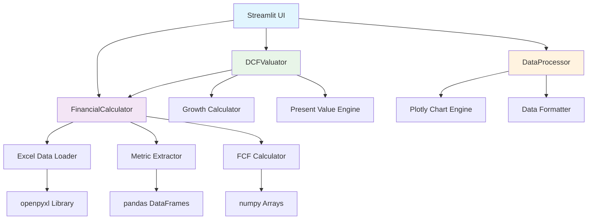

# FCF Application Architecture & Data Flow Guide

## Table of Contents
1. [System Architecture Overview](#system-architecture-overview)
2. [Component Diagram](#component-diagram)
3. [Data Flow Architecture](#data-flow-architecture)
4. [Module Dependencies](#module-dependencies)
5. [Processing Pipeline](#processing-pipeline)
6. [Error Handling Flow](#error-handling-flow)
7. [Performance Architecture](#performance-architecture)

---

## System Architecture Overview

The FCF Analysis application follows a **modular, layered architecture** that separates concerns and enables maintainability, scalability, and testing.

### Architectural Principles

1. **Separation of Concerns**: Each module has a specific responsibility
2. **Dependency Injection**: Components receive dependencies rather than creating them
3. **Data Flow Architecture**: Clear data transformation pipeline
4. **Error Boundary**: Graceful error handling at each layer
5. **Interface Consistency**: Standardized APIs between components

### Layer Structure

```
┌─────────────────────────────────────────────────────────────────┐
│                      Presentation Layer                         │
│  ┌─────────────────────┐    ┌─────────────────────────────────┐ │
│  │ Streamlit Web UI    │    │ Matplotlib Desktop UI (Legacy)  │ │
│  │ fcf_analysis_       │    │ fcf_analysis.py                 │ │
│  │ streamlit.py        │    │                                 │ │
│  └─────────────────────┘    └─────────────────────────────────┘ │
└─────────────────────────────────────────────────────────────────┘
┌─────────────────────────────────────────────────────────────────┐
│                      Business Logic Layer                       │
│  ┌─────────────────────┐    ┌─────────────────────────────────┐ │
│  │ Financial Calculator│    │ DCF Valuator                    │ │
│  │ financial_          │    │ dcf_valuation.py               │ │
│  │ calculations.py     │    │                                 │ │
│  └─────────────────────┘    └─────────────────────────────────┘ │
└─────────────────────────────────────────────────────────────────┘
┌─────────────────────────────────────────────────────────────────┐
│                      Data Processing Layer                      │
│  ┌─────────────────────┐    ┌─────────────────────────────────┐ │
│  │ Data Processor      │    │ Visualization Engine           │ │
│  │ data_processing.py  │    │ (Plotly Charts)                │ │
│  └─────────────────────┘    └─────────────────────────────────┘ │
└─────────────────────────────────────────────────────────────────┘
┌─────────────────────────────────────────────────────────────────┐
│                      Data Access Layer                          │
│  ┌─────────────────────┐    ┌─────────────────────────────────┐ │
│  │ Excel File Reader   │    │ Data Validation                 │ │
│  │ openpyxl integration│    │ Structure Checks               │ │
│  └─────────────────────┘    └─────────────────────────────────┘ │
└─────────────────────────────────────────────────────────────────┘
```

---

## Component Diagram

### Core Components Relationship



### Component Responsibilities

#### **FinancialCalculator** (`financial_calculations.py`)
- **Primary Role**: Core FCF calculation engine
- **Responsibilities**:
  - Load and parse Excel financial statements
  - Extract financial metrics from structured data
  - Calculate FCFF, FCFE, and LFCF
  - Validate data quality and completeness
  - Provide growth rate analysis

#### **DCFValuator** (`dcf_valuation.py`)
- **Primary Role**: DCF valuation modeling
- **Responsibilities**:
  - Project future FCF based on historical data
  - Calculate terminal values using Gordon Growth Model
  - Compute present values with discount rates
  - Generate enterprise and equity valuations
  - Perform sensitivity analysis

#### **DataProcessor** (`data_processing.py`)
- **Primary Role**: Data visualization and formatting
- **Responsibilities**:
  - Generate interactive Plotly charts
  - Create FCF trend analysis visualizations
  - Build DCF waterfall charts
  - Format data for display tables
  - Handle data aggregation and summarization

#### **Streamlit UI** (`fcf_analysis_streamlit.py`)
- **Primary Role**: User interface and workflow orchestration
- **Responsibilities**:
  - Manage user interactions and input validation
  - Coordinate between calculation and visualization components
  - Handle session state and data persistence
  - Provide real-time feedback and progress indication
  - Display results and enable export functionality

---

## Data Flow Architecture

### High-Level Data Flow

```
Excel Files → Data Loading → Metric Extraction → FCF Calculation → DCF Valuation → Visualization
```

### Detailed Data Flow Pipeline

#### **Stage 1: Data Ingestion**
```
Input: Company Folder Structure
├── FY/
│   ├── Income Statement.xlsx
│   ├── Balance Sheet.xlsx
│   └── Cash Flow Statement.xlsx
└── LTM/
    ├── Income Statement.xlsx
    ├── Balance Sheet.xlsx
    └── Cash Flow Statement.xlsx

Processing:
1. Folder validation
2. File categorization by name patterns
3. Excel workbook loading with openpyxl
4. DataFrame creation with proper headers

Output: financial_data dictionary
{
    'income_fy': DataFrame,
    'balance_fy': DataFrame,
    'cashflow_fy': DataFrame,
    'income_ltm': DataFrame,
    'balance_ltm': DataFrame,
    'cashflow_ltm': DataFrame
}
```

#### **Stage 2: Metric Extraction**
```
Input: financial_data dictionary

Processing:
1. Locate fiscal year columns (FY-9, FY-8, ..., FY)
2. Search for metric names in column 2
3. Extract numeric values from columns 3+
4. Handle data type conversion and formatting
5. Apply chronological ordering

Output: Metric arrays by type
{
    'EBIT': [year1, year2, ..., year10],
    'Net Income': [year1, year2, ..., year10],
    'Current Assets': [year1, year2, ..., year10],
    ...
}
```

#### **Stage 3: FCF Calculations**
```
Input: Metric arrays

Processing:
1. Calculate working capital changes
2. Compute dynamic tax rates
3. Apply FCF formulas for each type
4. Validate calculation results
5. Store in results dictionary

Output: fcf_results
{
    'FCFF': [fcf_year1, fcf_year2, ..., fcf_year9],
    'FCFE': [fcf_year1, fcf_year2, ..., fcf_year9],
    'LFCF': [fcf_year1, fcf_year2, ..., fcf_year10]
}
```

#### **Stage 4: DCF Valuation**
```
Input: fcf_results, valuation assumptions

Processing:
1. Calculate historical growth rates
2. Project future FCF (5-year default)
3. Calculate terminal value
4. Compute present values
5. Determine enterprise and equity values

Output: dcf_results
{
    'enterprise_value': float,
    'equity_value': float,
    'value_per_share': float,
    'projections': {...},
    'assumptions': {...}
}
```

#### **Stage 5: Visualization**
```
Input: fcf_results, dcf_results

Processing:
1. Generate interactive Plotly charts
2. Create data tables with formatting
3. Build waterfall charts for DCF breakdown
4. Apply styling and interactivity
5. Prepare export-ready formats

Output: Interactive visualizations and formatted data
```

---

## Module Dependencies

### Dependency Graph

```
┌─────────────────────┐
│ fcf_analysis_       │
│ streamlit.py        │
└─────────┬───────────┘
          │
          ▼
┌─────────────────────┐    ┌─────────────────────┐    ┌─────────────────────┐
│ financial_          │    │ dcf_valuation.py    │    │ data_processing.py  │
│ calculations.py     │◄───┤                     │    │                     │
└─────────┬───────────┘    └─────────────────────┘    └─────────┬───────────┘
          │                                                     │
          ▼                                                     ▼
┌─────────────────────┐    ┌─────────────────────┐    ┌─────────────────────┐
│ pandas              │    │ numpy               │    │ plotly              │
│ openpyxl            │    │ scipy               │    │ streamlit           │
│ logging             │    │ yfinance (optional) │    │                     │
└─────────────────────┘    └─────────────────────┘    └─────────────────────┘
```

### External Dependencies

#### **Core Libraries**
- **pandas**: Data manipulation and analysis
- **numpy**: Numerical computations and arrays
- **openpyxl**: Excel file reading and parsing
- **scipy**: Statistical calculations and regression analysis

#### **Visualization Libraries**
- **plotly**: Interactive web-based charts
- **streamlit**: Web application framework
- **matplotlib**: Legacy desktop UI support

#### **Optional Dependencies**
- **yfinance**: Market data fetching (for DCF assumptions)
- **logging**: Application logging and debugging

### Import Strategy

```python
# Core calculation module
import pandas as pd
import numpy as np
from openpyxl import load_workbook
import logging

# Visualization modules
import plotly.graph_objects as go
import plotly.express as px
import streamlit as st

# Statistical analysis
from scipy import stats
```

---

## Processing Pipeline

### Sequential Processing Flow

#### **Phase 1: Initialization**
```python
def initialize_application():
    1. Set up logging configuration
    2. Initialize Streamlit session state
    3. Configure page layout and styling
    4. Create component instances
    
    Components Created:
    - FinancialCalculator()
    - DCFValuator()
    - DataProcessor()
```

#### **Phase 2: Data Loading**
```python
def load_financial_data(company_folder):
    1. Validate folder structure
    2. Categorize Excel files by type
    3. Load each Excel file with error handling
    4. Parse and structure data into DataFrames
    5. Store in financial_data dictionary
    
    Error Handling:
    - Missing folders → User notification
    - Corrupt Excel files → Skip with warning
    - Invalid data formats → Default values
```

#### **Phase 3: FCF Calculation**
```python
def calculate_all_fcf_types():
    1. Extract required metrics from each statement
    2. Validate data completeness
    3. Calculate working capital changes
    4. Compute tax rates dynamically
    5. Apply FCF formulas for each type
    6. Store results with metadata
    
    Validation Steps:
    - Check array lengths consistency
    - Validate numeric conversions
    - Ensure chronological ordering
```

#### **Phase 4: DCF Valuation**
```python
def perform_dcf_analysis(assumptions):
    1. Analyze historical FCF growth patterns
    2. Project future cash flows
    3. Calculate terminal value
    4. Compute present values
    5. Determine enterprise and equity values
    
    Assumptions Handling:
    - Use defaults if not provided
    - Validate assumption ranges
    - Apply sensitivity analysis
```

#### **Phase 5: Visualization**
```python
def generate_visualizations():
    1. Create FCF trend charts
    2. Build growth analysis plots
    3. Generate DCF waterfall charts
    4. Format data tables
    5. Apply interactive features
    
    Chart Types:
    - Line plots for trends
    - Bar charts for comparisons
    - Waterfall for DCF breakdown
    - Heatmaps for sensitivity
```

### Parallel Processing Opportunities

#### **Concurrent Operations**
- **Excel File Loading**: Multiple files can be loaded simultaneously
- **Chart Generation**: Different visualizations can be created in parallel
- **Growth Rate Calculations**: Multiple periods can be computed concurrently

#### **Async Processing Potential**
```python
async def load_financial_statements_async():
    tasks = [
        load_excel_data_async(income_file),
        load_excel_data_async(balance_file),
        load_excel_data_async(cashflow_file)
    ]
    results = await asyncio.gather(*tasks)
```

---

## Error Handling Flow

### Error Hierarchy

```
ApplicationError
├── DataError
│   ├── FileNotFoundError
│   ├── InvalidDataFormatError
│   └── InsufficientDataError
├── CalculationError
│   ├── MetricNotFoundError
│   ├── InvalidCalculationError
│   └── ValidationError
└── VisualizationError
    ├── ChartGenerationError
    └── DataFormattingError
```

### Error Handling Strategy

#### **Layer-Specific Error Handling**

**Data Access Layer:**
```python
try:
    financial_data = load_excel_data(file_path)
except FileNotFoundError:
    logger.error(f"Financial statement file not found: {file_path}")
    return empty_dataframe_with_structure()
except PermissionError:
    logger.error(f"No permission to read file: {file_path}")
    raise UserReadableError("Please check file permissions")
```

**Business Logic Layer:**
```python
try:
    fcf_values = calculate_fcf_to_firm()
except MetricNotFoundError as e:
    logger.warning(f"Required metric missing: {e.metric_name}")
    return partial_results_with_warning()
except ValidationError as e:
    logger.error(f"Data validation failed: {e.details}")
    raise CalculationError("Unable to calculate FCF with current data")
```

**Presentation Layer:**
```python
try:
    st.plotly_chart(fcf_chart)
except VisualizationError:
    st.error("Unable to generate chart. Please check data quality.")
    st.info("Try refreshing the data or contact support.")
```

### Graceful Degradation

#### **Partial Results Strategy**
```python
def calculate_with_degradation():
    results = {}
    
    # Try each FCF type independently
    for fcf_type in ['FCFF', 'FCFE', 'LFCF']:
        try:
            results[fcf_type] = calculate_fcf_type(fcf_type)
        except CalculationError:
            logger.warning(f"Unable to calculate {fcf_type}")
            results[fcf_type] = []
    
    return results
```

#### **User Communication**
```python
def handle_partial_results(results):
    successful = [k for k, v in results.items() if v]
    failed = [k for k, v in results.items() if not v]
    
    if successful:
        st.success(f"Successfully calculated: {', '.join(successful)}")
    
    if failed:
        st.warning(f"Unable to calculate: {', '.join(failed)}")
        st.info("Check data completeness for missing calculations")
```

---

## Performance Architecture

### Optimization Strategies

#### **Memory Management**
- **Lazy Loading**: Load data only when needed
- **Memory Pooling**: Reuse DataFrame objects
- **Garbage Collection**: Explicit cleanup of large objects
- **Streaming**: Process large datasets in chunks

#### **Computation Optimization**
- **Vectorized Operations**: Use NumPy and pandas vectorization
- **Caching**: Store expensive calculation results
- **Memoization**: Cache function results for repeated calls
- **Algorithmic Efficiency**: O(n) algorithms where possible

#### **I/O Optimization**
- **Batch Reading**: Read multiple Excel files efficiently
- **Connection Pooling**: Reuse file handles
- **Async I/O**: Non-blocking file operations
- **Compression**: Use compressed data formats where applicable

### Performance Monitoring

#### **Metrics Collection**
```python
import time
import psutil

def monitor_performance(func):
    def wrapper(*args, **kwargs):
        start_time = time.time()
        start_memory = psutil.Process().memory_info().rss
        
        result = func(*args, **kwargs)
        
        end_time = time.time()
        end_memory = psutil.Process().memory_info().rss
        
        logger.info(f"{func.__name__}: {end_time - start_time:.2f}s, "
                   f"Memory: {(end_memory - start_memory) / 1024 / 1024:.1f}MB")
        
        return result
    return wrapper
```

#### **Bottleneck Identification**
- **Excel Loading**: Typically the slowest operation
- **Metric Extraction**: Can be optimized with better indexing
- **Chart Generation**: Memory-intensive for large datasets
- **Data Validation**: Can benefit from early termination

### Scalability Considerations

#### **Horizontal Scaling**
- **Microservices**: Split calculation and visualization services
- **API Gateway**: Expose calculation engine as REST API
- **Load Balancing**: Distribute requests across multiple instances
- **Caching Layer**: Redis for shared calculation results

#### **Vertical Scaling**
- **Multi-threading**: Parallel processing for independent calculations
- **Process Pooling**: Utilize multiple CPU cores
- **Memory Optimization**: Reduce memory footprint per calculation
- **Algorithm Improvement**: More efficient calculation methods

This architecture guide provides a comprehensive understanding of how the FCF application is structured, how data flows through the system, and how different components interact to deliver robust financial analysis capabilities.